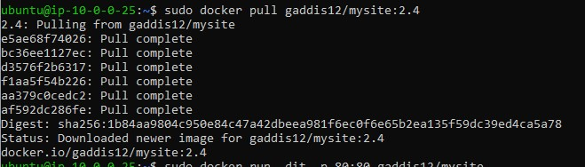
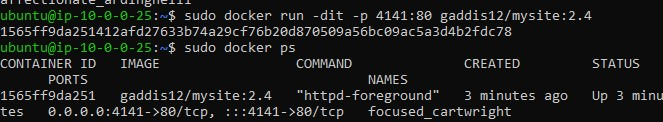

- This project will allow me to run a webpage tha is located inside my container using my instance IP and port 8080. 
-  to install docker I used sudo apt-get install docker-ce docker-ce-cli containerd.io and followed the instructions on https://phoenixnap.com/kb/how-to-install-docker-on-ubuntu-18-04#:~:text=How%20to%20Install%20Docker%20on%20Ubuntu%201%20Step,official%20Docker%20website%20does%20not%20offer...%20See%20More.
- To build and run my container image I used sudo docker run -dit --name basic -p 8080:80 -v /home/ubuntu/cicd-gaddis12/project6/websites:/usr/local/apache2/htdocs/ httpd:2.4 
- To view my project I open a browser and put in my IP:port. 
- Part 2 
- To create a public repo on docker you go to repository and create name it and choose public then click create. 
- To allow dockerhub authentication through the command line you have to run sudo docker login. Use your username and either real password or token. 
- To configure Github credentials you give a name and value. You set secrets and set their name 
- To create my work flow I had to change my branch variable to main. then I had to specify my repo for docker hub and give the name of secrets for github to be able to access my dockerhub with my login credentials. 
- Part 3 
 
   